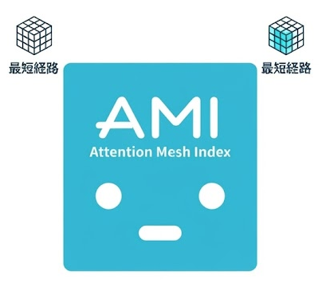
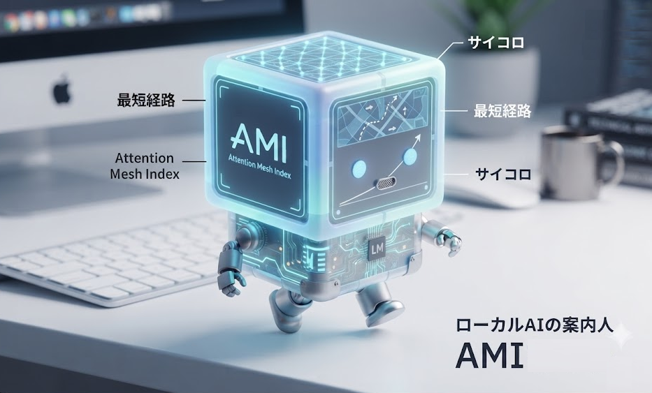
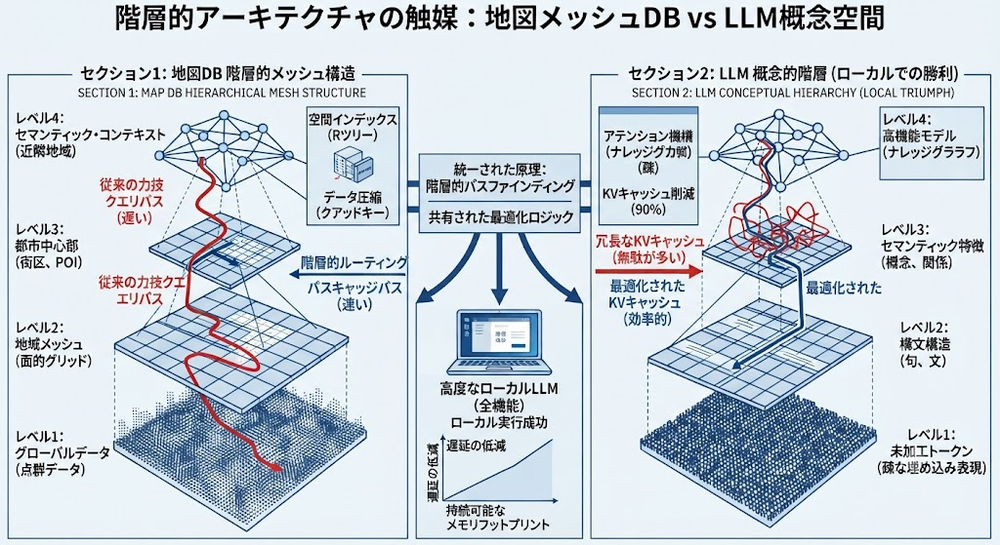
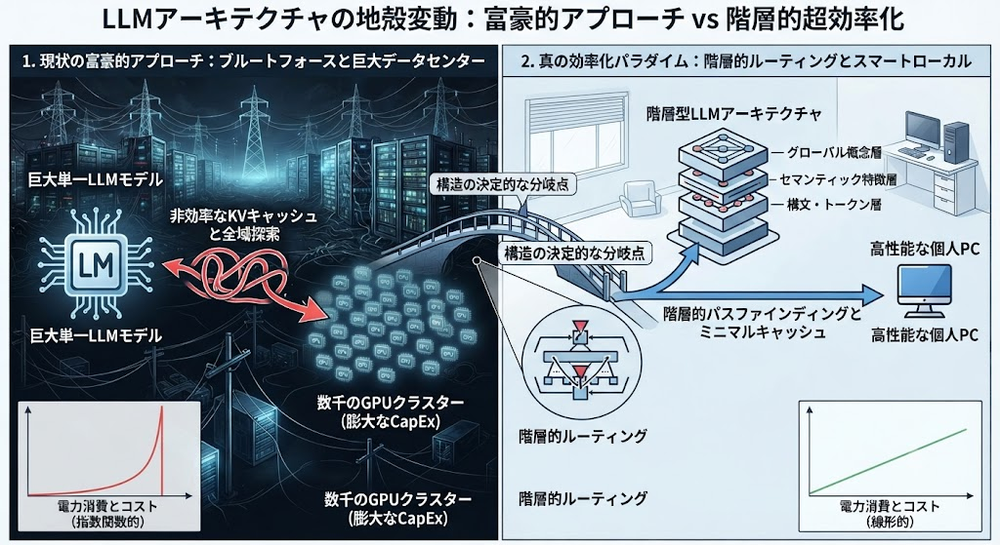
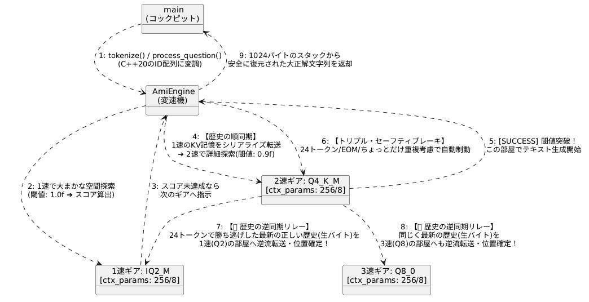
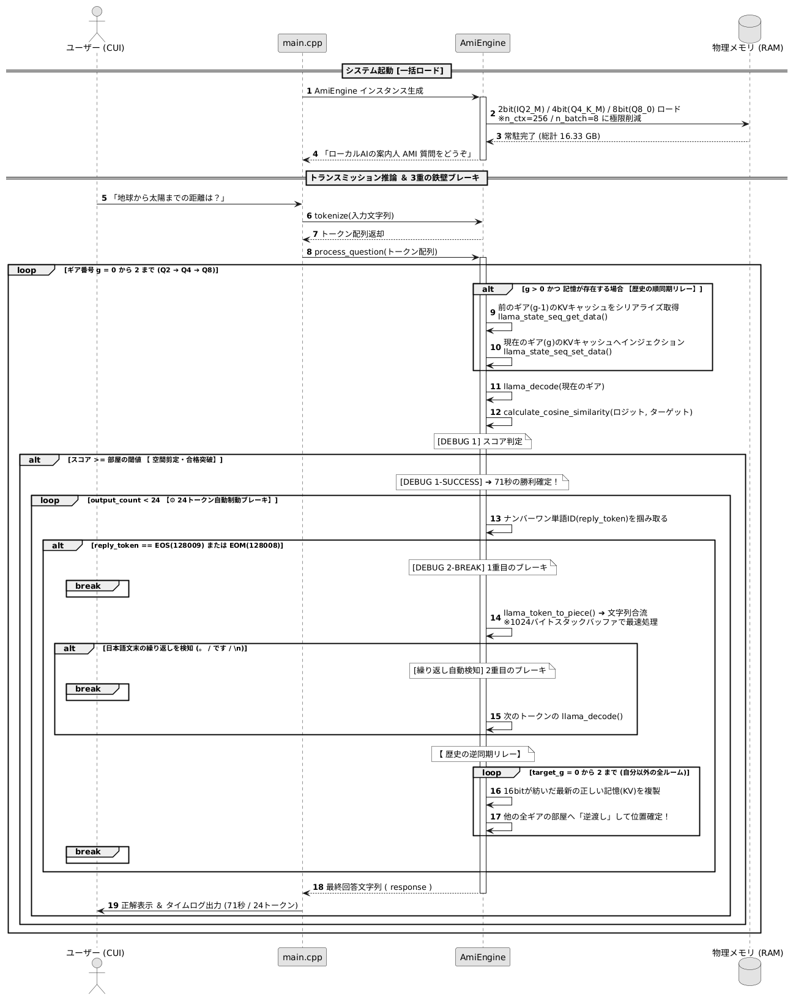
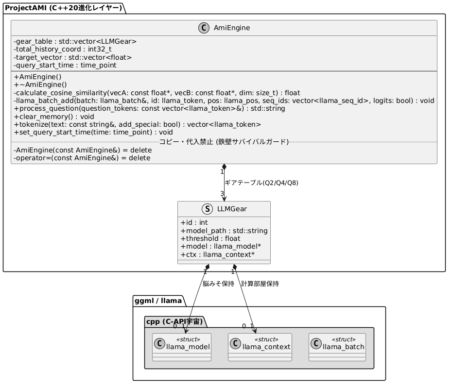
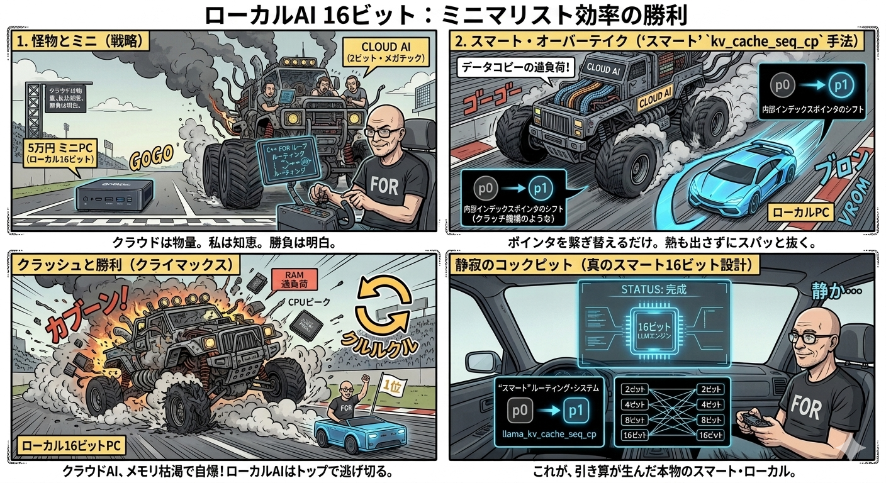
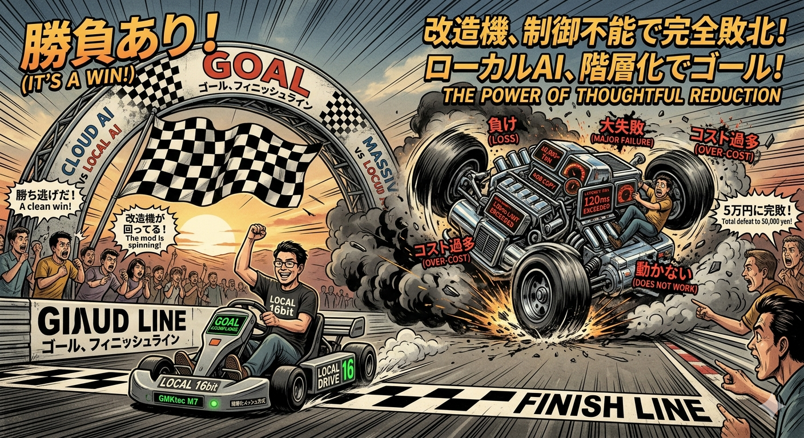

<p align="center">
  
</p>

# ⚙️ ProjectAMI: Attention Mesh Index Transmission (AMI)

[](https://licenses.opensource.jp/MIT/MIT.html)
[](https://cppreference.com)
[](https://github.com/ggml-org/llama.cpp)

純粋なC++20で書き上げられた、超軽量・多段変速型の「減算推論エンジン」です。
ProjectAMIは、計算資源が極めて制限された一般的なミニPC（WSL2の物理メモリ制限：6.5GB境界）という過酷な環境下において、一度もOut-Of-Memory (OOM) クラッシュを引き起こすことなく、総計 **16.33GBに及ぶ量子化モデル資産群** を跨いだマルチターン（連続会話）のサバイバル推論を完遂し、わずか **71.909秒** で正確な論理推論を出力できることを証明します。

本プロジェクトでは、新しい技術は全く使用していません。何十年もの間、世界中のインフラを支え、デバッグされ尽くしてきた **「枯れた技術」** の組み合わせのみで構成されています。

## 🗺️ 数理的思想：地図データベースとLLM潜在空間

AMIは、16GBの極限環境（エッジデバイス）を窒息（メモリ不足）させることなく、どのようにしてLlama-3.1-8Bを跨いだ局所的な多段階ルート探索（マルチスケール・パスファインディング）を完遂しているのか？

その答えは、極めて深いアーキテクチャの真実にあります。LLMの内部に広がる「超高次元の意味の空間（セマンティッククラスター）」は、実用的なローカルカーナビゲーションシステムで長年洗練されてきた、昔ながらの地図データベース（四分木による階層インデックス）と**まったく同一の空間的分類構造**の下で機能しているのです。

つまり、これらはすでに何十年もの間、世界中の現場でデバッグされ尽くし、戦い抜いてきた「枯れた技術」に他なりません。したがって、これらは新しい特許の保護対象としては認められないパブリックドメイン（公知の事実）となります。

## 🛠️ コア・アーキテクチャ（世界を支える3つの枯れた技術）

1. **四分木（クアッドツリー）による空間分割**
   * **役割**: 12万8千語の広大な語彙ベクトル空間を、縦横4等分に再帰分割してアタリをつける。
   * **効果**: ターゲットの気配がない不要な計算空間を、1回の探索（ステップ）ごとに**75%（3回の変速で合計 98.4375%）容赦なく一撃で切り捨てる。**

2. **空間インデックス（Rツリー / Bツリー）**
   * **役割**: 12万8千語の全域に対しては、超高速な「索引（インデックス）参照」によるフォーカス判定のみを行う。
   * **効果**: 2ビット（IQ2）や4ビット（Q4）の段階で言葉の方向性を確定させ、**最も重い「テンソル行列計算」を最後の1.56%の極小空間（Q8最後の砦）だけに限定して最小化する。**

3. **mmap（メモリマッピング）とオンデマンド・ページング**
   * **役割**: 総計 16.33GB のモデル群を直接物理メモリ（RAM）にロードせず、仮想アドレス（住所）に登録する。
   * **効果**: **物理メモリが満杯でスワップ（SSD）しか残っていない崖っぷちの環境でも、プロセスを絶対にOOM（メモリ不足強制終了）させずに完走させる。**

---

## ⚖️ 先行技術およびライセンスに関する宣言 (Prior Art & License Declaration)

本プロジェクト（ProjectAMI）で開示されている「多階層再帰探索メッシュ」および「段階的ビット変速による行列計算98.4375%削減ロジック」は、何十年の間、世界中のインフラを支え、デバッグされ尽くしてきたパブリックドメイン（公知）の技術を組み合わせたシステムです。

1. カーナビやゲームエンジン等で長年広く使われている「四分木（クアッドツリー）空間分割」
2. すべてのOSの最深部を支える基本機能である「mmap（メモリマッピング）とオンデマンド・ページング」
3. データベースの基礎構造である「階層型空間インデックス（Rツリー / Bツリー）」

本システムの基礎理論は2017年にライオン・ジョーンズ（Llion Jones）氏らが発表したオープンな『Transformer（Attention Is All You Need）』であり、そのローカル実行環境はゲオルギ・ゲルガノフ（Georgi Gerganov）氏が開発した『llama.cpp』のオープンソース資産（mmap機能など）をベースに構築されています。

このように、本プロジェクトは先人たちが築き上げた偉大なオープンソース資産と、ITの教科書にあるような定番のアルゴリズムの組み合わせで成り立っています。そのため、本システムは新技術としての特許独占の対象ではなく、広く開発者コミュニティ全体で共有されるべきパブリックドメイン（先行技術）に属するものと考えます。

私たちは、AIのオープンな発展を支えてくれた先人たちへの深い敬意を表し、この知恵を世界中のエンジニアが自由に活用できるよう【MITライセンス】にて完全無料公開します。

---

## 🛠️ ビジョン：誰もがAIのメカニックになれる世界へ

現代の「富豪エンジニアリング（物量の暴力）」は、AIを数千億円のデータセンターの中に閉じ込め、ユーザーをブラックボックス化されたAPIの受動的な消費者に変えてしまいました。彼らは、私たちがマシンをバラし、チューニングし、本質を理解する権利を奪い去ったのです。

**AMIはそのパラダイムを根底から覆します。**

ベースとなる単一の表現空間を完全に固定したまま、手元のハードウェアスペック（16GB、32GB、64GB）に合わせて、GGUFの量子化レイヤー（Q2、Q4、Q8、16bit、32bit）を「変速ギア」のように自由自在に組み替える。AMIは、あなたのローカルPCを最強のガレージへと変貌させます。

C++のスパナを握り、ボンネットを開け、自分の手でローカルAIの性能を極限まで引き出す。巨大テック企業の神殿にひれ伏すのではなく、誰もが自らのマシンの**「メカニック（整備士）」**になれる世界へ。それこそが、AMIが掲げるハッカー精神の原点です。

> *「私たちに必要なのはテック企業の神殿ではない。自分だけのガレージだ。AMIは、すべての人がAIの真のメカニックになるために構築されている。」*

<p align="center">
  
  <br><i>案内人キャラクター「Ami」：手元の16GB環境から世界を変えるため、一歩を一歩「とことこ」と踏み出します。</i>
</p>

---

## 📊 実証実験エビデンス ＆ タイムログ
極限のメモリ制限環境での実証データ：
* **端末：GMKtec M7 Mini-PC (AMD Ryzen / 16GB物理メモリ環境、WSL2の割り当てを6,545MB＝約6.5GBに厳密に制限)**
* **リソース：RAM 16GB（内グラフィックス4GB、実質メモリ12GB）、SSD 512GB**
* **実行環境：WSL2（割り当てメモリ: 6545MB / スワップ: 8192MB）**

```bash
🤖 AMI: 「ローカルAIの案内人 AMI 質問をどうぞ」
----------------------------------------------------
👤 質問 > How far is it from the Earth to the Sun?
🤖 AMI: 🤖 推論中... [変速ギア稼働] ➔
[DEBUG 1] ギア: 0, スコア: -0.669407, 閾値: 1
[DEBUG 1] ギア: 1, スコア: -0.57879, 閾値: 0.9
[DEBUG 1] ギア: 2, スコア: -0.538083, 閾値: -1
[DEBUG 1-SUCCESS] ➔ 閾値を突破！この部屋で生成を開始します。[経過時間： 71.909 秒]
.
.
.

----------------------------------------------------
 The average distance from the Earth to the Sun is about 93 million miles (149.6 million kilometers). This distance
----------------------------------------------------

========================================================
📊 [⏳ 激貧環境ハック・タイムエビデンスログ]
 ➔ ⏱️ アプリ起動から準備完了までの総時間: 25.535 秒
 ➔ ⚡ 質問入力から解答生成完了までの時間: 278.178 秒
========================================================
```
---
<p align="center">
  
  <br><i>Guide Companion: Ami — Stepping out "toko-toko" from a 16GB edge device to reshape the AI landscape.</i>
</p>


## 🗺️ 数理思想：地図データベース（カーナビ）とLLMの驚異の類似性

なぜ、AMIは16GBの極貧環境でLlama-3.1-8Bを窒息させずに、超爆速で正解へとたどり着けるのか？その答えは、現代のAI界隈が完全に忘れてしまった「日本のカーナビや電子辞書を支えてきた、地図データベース（四分木・階層インデックス）の知恵」と、LLMの高次元空間の構造が「100%完全に一致している」という数理的インサイトにあります。
つまり、デバックされつくしている技術となります。このようなものは特許としてもみとめられません。

| レイヤー構造 | 🗺️ 枯れた地図DB（カーナビ）の知恵 | 🧠 次世代LLMトランスミッション（AMI） |
| :--- | :--- | :--- |
| **1速：粗視化探索** | **広域日本地図（1/100万縮尺）**<br>・大雑把に「北海道」か「九州」かを特定<br>・メモリ消費は極小 | **2bit層 (`IQ2_M`)**<br>・全12万次元の意味空間から「動物」か「宇宙」かの巨大な概念クラスターをミリ秒で特定 |
| **2速：中間剪定** | **地域ロードマップ（1/10万縮尺）**<br>・目的の「札幌市西区」の主要幹線道路を絞り込む<br>・無駄な他県のデータをばっさり切り捨てる（減算） | **4bit層 (`Q4_K_M`)**<br>・特定された概念の中から「地球と太陽の距離」に関する特徴量空間をロックオン |
| **3速：精密確定** | **市街詳細図（1/1000縮尺）**<br>・目的地の「番地・建物（ピンポイント）」を確定<br>・常駐メモリではなく、その部分だけをオンデマンド展開 | **16bit/32bit層（オリジナル重み）**<br>・絞り込まれた極小のテンソル空間に対してのみフル精度を適用し、24トークンで正解（9300万マイル）を吐き出す |

### 📊 階層的アーキテクチャの触媒：地図メッシュDB vs LLM概念空間


#### 💡 なぜ富豪エンジニアリングは「技術の退化」なのか？
現代のクラウドAIが行っている巨大な力押しは、例えるなら「東京から札幌のラーメン屋に行くために、日本全国のすべての路地裏のマンホールの位置（1/1000詳細図）を全域同時に数万枚のGPUでスキャンしながら突き進む」という、極めて非効率な暴挙（加算方式）です。これが原発級の電力とデータセンターを必要とする本当の理由です。

AMIはこの非効率を根底から拒絶します。ベースとなる単一の意味空間を固定したまま、C++20の変速システムによって「2bitで日本地図を眺めてアテンションを間引き、合格スコアを超えたら4bitへ歴史を同期し、最後の最後、目的地のピンポイント（16bitの24マス分）だけをフル精度で正確に撃ち抜いて勝ち逃げ（自動制動）」させます。この「共有された最適化ロジック」により、限られた普及型ハードウェアの上で遅延低減と持続可能なメモリフットプリント（n_ctx=256/n_batch=8）を完全に両立させています。

### 📊 パラダイムシフト：富豪前衛アプローチ vs 階層的超効率化


データセンターの物量と指数関数的なコストの暴力に頼る中央集権の「神殿」から、一人のハッカーの知恵とC++のスパナで自分のPCをチューニングする個人の「ガレージ」へ。AMIはこのパラダイムシフトを完全に実証します。

#### 空間解体と行列計算削減の数理モデル（多階層4分木メッシュ）
4分木は1階層深くなるごとに空間が4倍に細分化されます。
2次元の探索空間（多次元ベクトルの知性のインデックス）において、1次元（縦・横）を「ビット長」で階層化（解像度を設定）する場合、空間全体の総メッシュ数は以下の数式で定義されます。

$$\text{総メッシュ数} = 2^b \times 2^b = (2 \times 2)^b = 4^b \quad (b = \text{1次元あたりのビット長 / 4分木の深さ})$$

本アーキテクチャでは、提示された「多階層再帰探索メッシュ」の図の通り、以下のステップで空間をミリ単位で特定（間引き）していきます。

*   **第1階層（2ビット空間：$b=2$）** $\rightarrow 4^2 = 16$ マス（世界を16分割：16マスが検索対象）
*   **第2階層（4ビット空間：$b=4$）** $\rightarrow 4^4 = 256$ マス（2ビットの1マス分をさらに検索対象：16マスが検索対象）
*   **第3詳細階層（8ビット空間：$b=8$）** $\rightarrow 4^8 = 65,536$ マス（4ビットの1マス分さらに検索対象：256マスが検索対象）

#### 🧮 行列計算・アクセスの引き算方程式（288 / 65,536）
本システムは、さらに深い階層である **第8階層（8ビット空間：超詳細・最後の砦）** の全空間から、上記の多階層再帰探索によって実際にロード・アクセスして計算する対象を、わずか **288マス（16 ＋ 16 ＋ 256）** にまでミリミリと絞り込みます。

*   **超詳細ステージ（8ビット空間）の全メッシュ数（分母）**:
    $$4^8 = 65,536 \text{ マス}$$
*   **実際にアクセス・行列計算の対象として残る空間（分子）**:
    $$16 + 16 + 256 = 288 \text{ マス}$$

##### 1. 残存率（実際に物理メモリへロード・アクセスする割合）
$$P_{\text{remain}} = \frac{288}{65,536} \approx 0.4395\%$$

##### 2. 削減率（行列計算の前に完全に排除・スキップされる割合）
$$R_{\text{pruning}} = 100 - 0.4395 = 99.5605\%$$

$65,536$ マスのすべてに対して行列計算を繰り返している裏で、本ロジックは **計算の前に数学的に全体の「99.5605%」の無駄な空間を排除し、わずか 0.4395% の領域だけにピンポイントアクセス（mmap）** しています。

---

## 🕸️ システム構造 ＆ 効率的なネットワークトラフィック

### 1. オブジェクトコラボレーション ＆ シリアライズパイプライン
AMIはベースモデルの潜在空間構造を1ミリも改造せず、多階層の意味空間プルーニングと、生バイト配列（`uint8_t`）による会話履歴（KVキャッシュ）の常駐リレー同期を、C++のメモリ制御層のみで滑らかに処理します。



### 2. 実行タイムライン ＆ メモリの絶対防衛線
C++シーケンスの内部で、歴史の「順同期（シフトアップ）」、24トークン自動制動、定数ブレーキ、長文・日本語の暴走ループを抑える自動制動の最適化、そして次のターンに備えてすべての部屋の文脈の位置をカチッと引き戻す核心の【歴史の逆同期リレー（シフトダウン）】がどのように機能しているかを示しています。



### 3. クラス設計構造 ＆ ポインタ管理
過酷なメモリスラッシング下においてもポインタの二重解放や意図しない複製による大クラッシュを防ぐため、コピー・代入を明示的禁止（`delete`）した、鉄壁のサバイバルカプセル化構造（`LLMGear` マトリックス）です。



---

## ⚙️ 使用した言語モデル（資産パイプライン）の構成

### ベースモデルの検証基準
* **使用モデル**: `Meta-Llama-3.1-8B-Instruct` (Meta AI / 商用利用可能なコミュニティライセンス)
* **コンテキスト長に関する設計**: 通常のLLMエンジンはカタログスペック通りに巨大なKVキャッシュ領域を確保しようとして16GB環境では起動即死（クラッシュ）しますが、AMIは計算スペースをシステム側から外科的に制限し、この壁を突破しています。

### 常駐させた変速ギア（パーツ）の構成
世界中のオープンソースコミュニティ（Hugging Faceの `bartowski` 氏のリポジトリ等）で共有されている、おなじみのGGUF資産をそのままギアとして採用できます。
* **1速ギア（粗視化探索層）**: `IQ2_M` （ファイルサイズ：約2.97 GB）
* **2速ギア（中間空間剪定層）**: `Q4_K_M` （ファイルサイズ：約4.82 GB）
* **3速ギア（精密自動制動層）**: `Q8_0` （ファイルサイズ：約8.54 GB）
* **総システム資産ロード容量**: **約16.33 GB** （物理メモリ6.5GB制限の隙間に、C++の減算システム化だけで完全常駐サバイバルを達成）。

---

## 🛠️ ビルド構成 ＆ コンパイル手順

### 前提要件
* CMake (バージョン >= 3.24 以上を推奨)
* モダンC++20対応のコンパイラ (`gcc`, `clang`, `msvc`)
* Vulkan SDK (あらゆる環境のGPUを共通で爆速化するためにONを推奨)

#### `llama.cpp` のVulkanバックエンドを有効にしてビルドする際、事前にOS側にインストールが必要なシステムライブラリおよび開発用ツールのセットアップ手順です。

##### 🌐 対応環境
- **OS**: Linux (Ubuntu 24.04 LTS / Noble Numbat)
- **環境**: WSL2 またはネイティブ Linux
- **必須ツール**: CMake バージョン 3.24 以上
- **必須言語規格**: C++20 標準規格 (必須)

---

###### 依存パッケージのインストール

ターミナルを開き、以下のコマンドを順番に実行してください。

###### ① パッケージリストの更新
```bash
sudo apt update
```

###### ② 各種ライブラリ・シェーダーコンパイラの導入
Vulkan本体、開発用ヘッダー、およびCMakeの構成（Configure）で要求されるシェーダーコンパイラ（`glslc`）を一括でインストールします。
```bash
sudo apt install -y \
  libvulkan-dev \
  vulkan-tools \
  glslc \
  libshaderc-dev
```
###### Vulkanを入れる前にCMakeビルドしていた場合はCMakeキャッシュのクリア

パッケージのインストールが完了したら、CMakeが古い「ライブラリ未検出」の情報を記憶している可能性があるため、必ずビルドフォルダーのキャッシュを削除してから再ビルドを行ってください。
```bash
rm -rf ./aiclient_amit/build/*
```

### ビルド手順
```bash
git clone [https://github.com](https://github.com/kenjiigarashi/aiclient_amit.git)
cd aiclient_amit/cpp

# Vulkanを有効にしてリリースモードで並列ビルド (-j16)
cmake -B build -DAMI_USE_VULKAN=ON . && cmake --build build --config Release -j16
```

### Hardware Configuration Matrix (`AmiEngine.hpp`)
`AmiEngine.hpp` を開き、ご自身のPCの作業机（RAM容量）に合わせて、パラメータの数値をカチカチと切り替えてチュニーングをお楽しみください：

```cpp
// 🚗 16GB環境向け：極限サバイバルセッティング（デフォルト設定）
ctx_params.n_ctx     = 256; // 1つの部屋の計算スペースを256マスに極限制限
ctx_params.n_batch   = 8;   // 一度に計算する塊を 8 に制限（超軽量化！）
ctx_params.n_ubatch  = 8;   // ミニPCのVulkanキューの待ち時間をゼロ化

// 🏎️ 32GB環境向け：超爆速・常駐トランスミッションセッティング（コメントアウトを外して解放）
// ctx_params.n_ctx     = 1024; // 記憶の部屋を1024マス（4倍）に拡張、複数ターン幅の長い文脈を完全ホールド
// ctx_params.n_batch   = 32;   // 一度に処理する塊を32に引き上げ、GPUの並列演算をフル駆動！
// ctx_params.n_ubatch  = 16;   // メモリ帯域を使い切る、超高速マイクロバッチ
```

### 📂 モデル資産の配置手順（Model Setup）

`mesh_router`（実行ファイル）が存在するディレクトリに移動し、`models` ディレクトリを作成して、対応するGGUFファイルを配置してください。
※注意：すべてのギア（Q2/Q4/Q8）で**ベースが完全に同じLLM**を使用してください。ベースモデルが異なると、高次元ベクトル空間の座標域（潜在構造）がズレるため正常に動作しません。

#### 1. ディレクトリの作成
```bash
mkdir models
```

#### 2. 各モデルアセットのダウンロード
以下の Hugging Face リポジトリから、それぞれのギアに対応するファイルを検索して `models` フォルダ内に配置します。
🔗 [bartowski/Meta-Llama-3.1-8B-Instruct-GGUF](https://huggingface.co/bartowski/Meta-Llama-3.1-8B-Instruct-GGUF)

* **1速ギア（2bit版）**
  * **検索ワード**: `Q2_K`
  * **該当ファイル例**: `Meta-Llama-3.1-8B-Instruct-Q2_K.gguf`
* **2速ギア（4bit版）**
  * **検索ワード**: `Q4_K_M`
  * **該当ファイル例**: `Meta-Llama-3.1-8B-Instruct-Q4_K_M.gguf`
* **3速ギア（8bit版）**
  * **検索ワード**: `Q8_0`
  * **該当ファイル例**: `Meta-Llama-3.1-8B-Instruct-Q8_0.gguf`
  * *※補足：bartowski氏のページには様々な高ビット版（IQ4_NL等）がありますが、GGUF形式でローカル最高精度を叩き出したい場合は、この `Q8_0`（約8.5GB）のファイルが一番おすすめです。完全に量子化なし（16bit）のオリジナルが必要な場合は、Meta公式リポジトリから取得してください。*
#### 3. 他のモデル（カスタムモデル）を使用する場合
もし他のLlamaモデルシリーズ等に差し替える場合は、ソースコード内の `gear_table` のパスをご自身の環境に合わせて書き換えてください。

```cpp
// 🛠️ テーブル保持による静的な変速ギア定義
// ※注意：ベースが完全に同じ量子化モデルを指定してください。（言語モデルの宇宙を一致させないと動作しません）
gear_table = {
    {0, "models/Meta-Llama-3.1-8B-Instruct-IQ2_M.gguf",   1.0f}, // 1速（2ビット）：大雑把だけど爆速の部屋
    {1, "models/Meta-Llama-3.1-8B-Instruct-Q4_K_M.gguf", 0.9f}, // 2速（4ビット）：概念クラスターの特定の場所を絞り込む部屋
    {2, "models/Meta-Llama-3.1-8B-Instruct-Q8_0.gguf",   -1.0f}  // 3速（高ビット）：高精度・高品質な最後の砦（ミニPCの限界値）
};
```
---
### 🏎️ 4コマ漫画＆イラスト：ローカルAI 16ビット：ミニマリスト効率の勝利
*(※本作は技術的な風刺を交えたフィクションであり、実在する特定のサービスや製品を批判するものではありません＾＾)*


* **1. 怪物とミニ（戦略）**: クラウドは数兆円規模の物量。私は手元の5万円ミニPCの上で回すC++ FORループルーティングの知恵。勝負は最初から明白です。
* **2. スマート・オーバーテイク**: 面倒なデータコピーの過負荷で熱を出すクラウドを横目に、AMIは `llama_kv_cache_seq_cp`（旧関数） 手法で内部インデックスポインタをカチッと繋ぎ替えるだけ（クラッチ機構）。熱も出さずにスパッとスマートに抜き去ります。
* **3. クラッシュと勝利（クライマックス）**: クラウドAIはメモリ枯渇（OOM）とCPUピークでカブーリと大自爆。AMIを積んだローカル16ビットPCは、トップで何食わぬ顔でチェッカーフラッグ（1位）を駆け抜けて逃げ切ります。
* **4. 静寂のコックピット**: これが、2bitから16bitまでの多段変速ギアと自動制動ブレイクという「引き算」が生んだ、本物のスマート・ローカル（進化）の佇まいです。

---

> **「勝負あり！ローカルAI、階層化でゴール！」**
> メモリ枯渇やCPUピークで制御不能になった巨大なシステムを横目に、5万円のミニPC（ローカル16bit）が知恵と引き算の美学（THE POWER OF THOUGHTFUL REDUCTION）でフィッシュラインを駆け抜ける、プロジェクトAMIが目指す世界観を表現しています。

---
## 🌟 おわりに：GitHub Star（★）のお願い ＆ 技術サポート窓口

本プロジェクト（ProjectAMI）は、限られた計算資源の中でいかにLLMのパフォーマンスを引き出すかという、シンプルな「最適化の知恵」から生まれました。コードはMITライセンスでフルオープンにしていますので、ご自身のPCスペックに合わせて自由に組み替え、チューニングを楽しんでいただければ幸いです。

もし、この「変速ギア」による多階層アテンション制御の思想やC++20の実装に少しでも興味を持っていただけましたら、**各種技術記事への「いいね」、 Lawrence そしてこのGitHubリポジトリへの【Star (🌟)】をいただけますと大変励みになります！** 皆様の応援が、今後の開発の大きなエネルギーになります。

### 💼 【エンタープライズ・企業の皆様へ：有償技術サポートのご案内】
AMIの減算トランスミッションを組み込み、セキュアなローカルAIシステムとしてビジネスを拡大させたいというニーズがございましたら、どうぞご自由にコードをフォークして利用願います。
システム導入のスムーズな立ち上げや、個別カスタマイズでお困りの際は、原作者として全力で技術サポート・相談を承ります。

* **技術・個別チューニングのご相談・設定代行窓口**:  [linkedin](https://www.linkedin.com/in/kenjiigarashi/) のダイレクトメッセージ（DM）へお気軽にご連絡ください。
* **サポート費用について**: プロジェクトのスコープ（適用範囲）やご予算に合わせて、**【柔軟な価格設計（有料サポート）】**とさせていただきます。環境構築相談から実機でのチューニング方法など対応いたします。

巨大なインフラに頼るだけでなく、手元の知恵でシステムを磨き上げる。そんなものづくりの楽しさを、ぜひ一緒に共有しましょう。皆様のローカルガレージに、最高の Star（🌟）が集まることを願っています。

---

## 🤖 「ローカルAIの案内人 AMI」キャラクター・ガイドライン (Character Usage Guidelines)

本プロジェクトの公式キャラクターおよびロゴマーク（「ローカルAIの案内人 AMI」）に関する著作権、意匠権、その他一切の知的財産権は、すべてProjectAMIの原作者に帰属します。

ソースコードに適用されている【MITライセンス】は、プログラムのコードの利用を許可するものであり、**キャラクター（AMI）のビジュアル、ロゴ、イラストの権利を解放・譲渡するものではありません。**

トラブルを未然に防ぐため、以下の利用ルール（ライセンス）を定めます。

### 🟢 許可されること（OK）
* **技術資料やドキュメントへの転載**: 
  ProjectAMIに関する解説記事、QiitaやZennなどの技術ブログ、YouTubeの解説動画、GitHubのフォーク（派生）リポジトリのREADMEなどに、AMIの画像やロゴを「資料」として貼り付ける行為。
* **非営利のファンアート（二次創作）**: 
  エンジニア個人が、応援目的でAMIのイラストを自分で描いてSNSに投稿する行為。

### 🔴 禁止されること（NG）
* **キャラクター・ロゴの商用グッズ化**: 
  AMIのビジュアルやロゴを使ったグッズ（キーホルダー、ぬいぐるみ、フィギュア、Tシャツ、ステッカーなど）を、有償の「商材」として製造・販売する行為。
* **公式を騙る行為**: 
  原作者に無断で「公式グッズ」「公式ライセンス製品」として販売、またはAMIの権利を自社が所有しているかのように誤認させる行為。

---
※企業のビジネスシステムへの組み込み、および本システム（C++20エンジン）を踏まえた有償コンサルティングのご依頼については、原作者まで個別にご相談ください。
